Final project presentation
========================================================
author: Charles Murier & John NGO
date: 17-12-2019
autosize: true

Shiny app : https://charlesmurier.shinyapps.io/shiny-r/  
R presentation : http://rpubs.com/charlesmurier/finalProject  
Repo Github : https://github.com/Milanor9/finalProject

The side panel for trains
========================================================

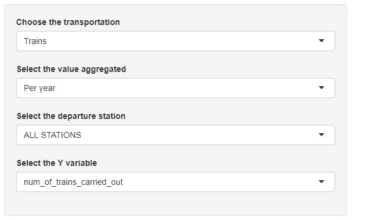
 

- We can choose the value aggregated between year and station
- If the value aggregated is year we can choose to see for only one station or for all stations
- Then we can choose the Y variable so we can see the graphic that we want

 

Examples of plots by year for all the stations
========================================================

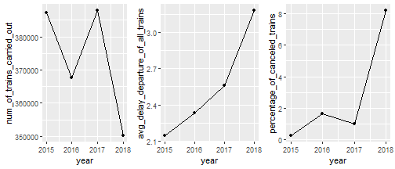
 
- We choose to plot a line when the graphic is shown by year because it's easier to see the evolution

Examples of plots by year for Paris Est station
========================================================

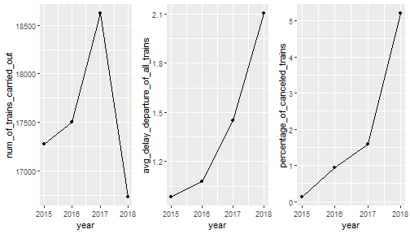

Example : number of trains late at departure by departure station 
========================================================
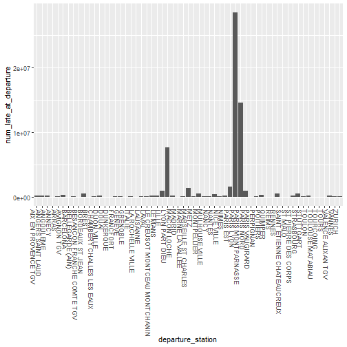

The side panel for flights
========================================================

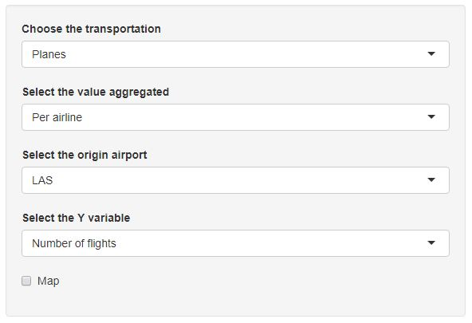
 

- We can choose the value aggregated between airline and origin airport
- If the value aggregated is airline we can choose to see for only one airport or for all airports
- Then we can choose the Y variable so we can see the graphic that we want
- If we click on map, the map representing the airports is displayed

 

Example: Average time in the air by airlines for all the airports
========================================================

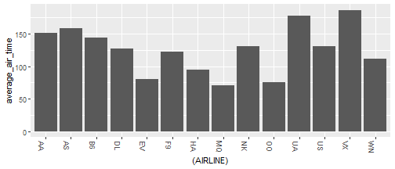
 

- This time we chose barplot because there is no evolution, it's only a comparison between the airlines

 

Example: Average time in the air by airlines for LAS VEGAS airport
========================================================

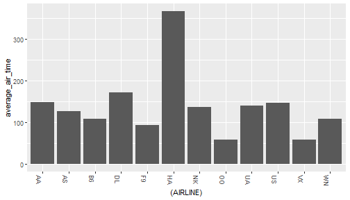

Example: Total distance of flights by airport
========================================================

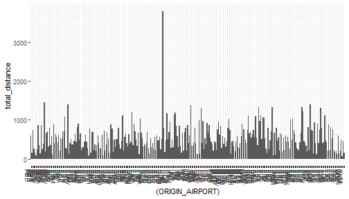

How the map is displayed
========================================================

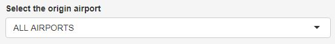
- When "all airports" is selected, the positions of all the airports are visible on the map

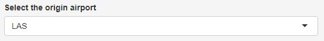
- When one specific airport is selected, the position of this specific airport is visible on the map

The map displayed when a specific airport is selected (1/2)
========================================================

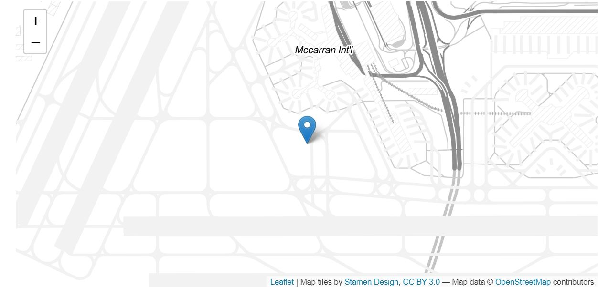

The map displayed when a specific airport is selected (2/2)
========================================================

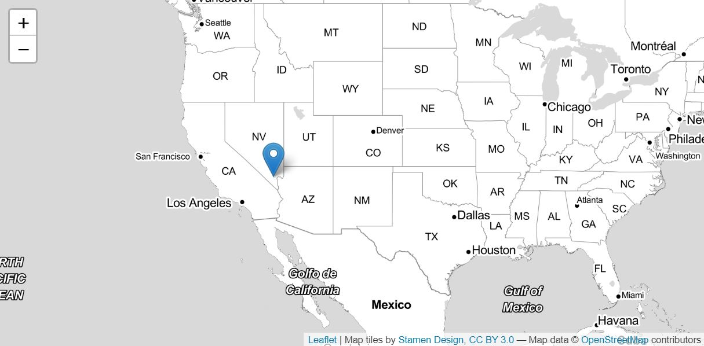

The map displayed when all airports are selected
========================================================

